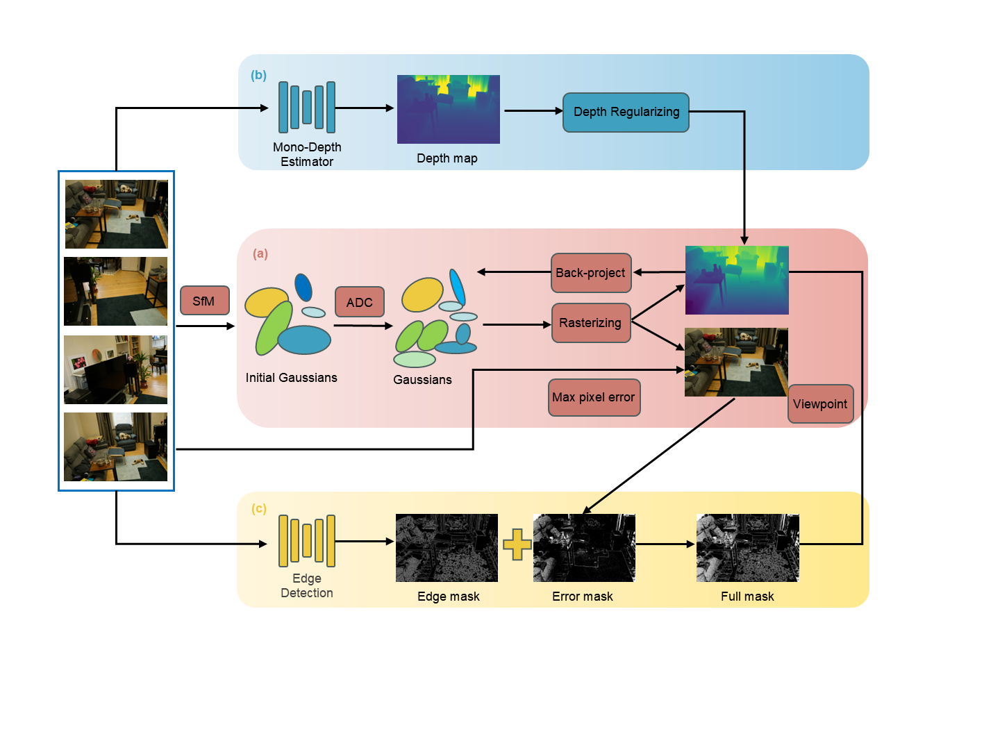

# MPD-GS: Mask-guided Point Densification for Gaussian Splatting

<div align="center">

[](https://doi.org/10.1016/j.neucom.2025.132438)
[](https://opensource.org/licenses/MIT)

</div>

> **Abstract**
> 3D Gaussian Splatting (3DGS) enables high-quality novel view synthesis by combining 3D Gaussian primitives with differentiable rendering, achieving impressive real-time performance. However, its Adaptive Density Control (ADC) mechanism struggles in regions with high-frequency details, leading to oversmoothing and loss of fine textures. This issue arises from the sparse distribution of initial Gaussian points, which hinders effective refinement. To address this limitation, we propose Mask-guided Point Densification Gaussian Splatting (MPD-GS), which enhances point distribution by selectively densifying Gaussian points in masked regions. We identify critical projection regions based on pixel-level error metrics during training and edge pixels extracted using Canny detection. These masked pixels are then back-projected into 3D space using depth information, improving detail preservation and rendering quality. Experiments on public benchmarks demonstrate that MPD-GS effectively recovers fine textures while maintaining computational efficiency, making it a versatile enhancement for both 2D and 3D Gaussian Splatting-based methods.

---

## 📚 Table of Contents
- [✨ Key Visuals](#-key-visuals)
- [🔧 Installation](#-installation)
- [🚀 Running](#-running)
- [✏️ Citation](#-citation)
- [🙏 Acknowledgements](#-acknowledgements)

---

## ✨ Key Visuals

### Method Overview
<div align="center">
  
</div>
*<p align="center"><b>Fig 2.</b> Framework of our method. (a) illustrates the core 3DGS process. (b) describes depth regularization. (c) outlines the edge extraction model.</p>*

### Qualitative Results
| Point Cloud Densification (Fig. 1) | Rendering Quality Comparison (Fig. 8) |
| :---: | :---: |
|  |  |
| *<p align="center"><b>Fig 1.</b> Comparison of point cloud distributions. Our method (d) effectively densifies sparse regions compared to others.</p>* | *<p align="center"><b>Fig 8.</b> Qualitative comparison of rendering quality, highlighting improvements in sparse regions (red boxes).</p>* |

---

## 🔧 Installation

### 1. Clone the Repository
**Important**: This is a repository with submodules. Please clone it with the `--recursive` flag to ensure all submodules are downloaded correctly.
```bash
git clone https://github.com/Geo3DSmart/MPD-3DGS.git --recursive
```

### **2. Set Up the Conda Environment**
```bash
conda env create -f environment.yml
conda activate MPD-3dgs
```

### **3.Depth regularization**
We use the original 3DGS depth regularization method, which can be specifically referenced in the official [3DGS](https://github.com/graphdeco-inria/gaussian-splatting) documentation.

## 🚀 Running

### **Datasets**
We follow the same dataset structure as the original Gaussian Splatting. You can use the provided data or place your own images in a folder under the `data/` directory and process them with COLMAP.

### **Training**
The training script is very similar to the original implementation.
Example: Train on the 'garden' scene from the Mip-NeRF 360 dataset
```bash
python train.py -s data/mipnerf360/garden -d <path to depth maps>
```
### **Evaluation**
```bash
python render.py -m output/<your_run_name>
```

## ✏️ Citation
If you find our work useful in your research, please consider citing our paper:


```bibtex
@article{HE2025132438,
title = {MPD-GS: Mask-guided point densification for Gaussian splatting},
journal = {Neurocomputing},
pages = {132438},
year = {2025},
issn = {0925-2312},
doi = {https://doi.org/10.1016/j.neucom.2025.132438},
url = {https://www.sciencedirect.com/science/article/pii/S0925231225031108},
author = {Junhui He and Wen Xiao and Guilong Wang and Jiteng Cheng and Jiaxing Zhang and Chao Yang},
}
```

## 🙏 Acknowledgements
This project 
is built upon the great work from [3DGS](https://github.com/graphdeco-inria/gaussian-splatting). We sincerely thank the authors for their excellent work. 

Our project also benefits 
from
 the following amazing open-source libraries:
- [3DGS](https://github.com/graphdeco-inria/gaussian-splatting)
- [AbsGS](https://github.com/TY424/AbsGS)
- [2DGS](https://github.com/hbb1/2d-gaussian-splatting)
- [Pixel-GS](https://github.com/zhengzhang01/Pixel-GS)
- [mini-splatting2](https://github.com/fatPeter/mini-splatting2)

